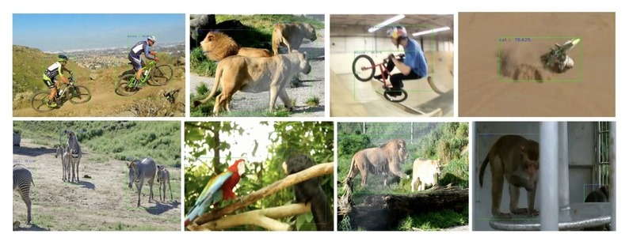
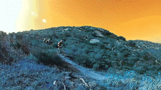

## Video Object Detection~ A pilot study


Contributors
* <strong>[@brillard1](https://github.com/brillard1)</strong>
* <strong>[@ceyxasm](https://github.com/ceyxasm)</strong>
---
This repository has been established to analyze and compare video object detection models. It explores design choices, differences, and performance while addressing challenges specific to video object detection. We reviewed and implemented [these](./papers/) papers.

### Youtube Video, Presentation & Report
* Please find the final report [here](./B20CS002_B20CS003_VOD_PS.pdf)
* The ppt used in the video can be found [here FILL]()
* YouTube video

[]() 
---

### Execution

#### ImageAI

Download the ImageAI library using pip and proceed with the executions.
```
pip install imageai
```

The RetinaNet, YOLOV and TinyYOLOV weights can be loaded from the offcial repository [here](https://github.com/OlafenwaMoses/ImageAI/blob/master/imageai/Detection/VIDEO.md)

Change the current working directory
```
cd Models
```
Run the `FirstVideoObjectDetection.py` to detect objects from parsed video file (change path to file location) :
```
python FirstVideoObjectDetection.py file_name
```


Run real-time statistics:
```
python gui.py file_name
```

Run the selected model for real time detection with camera input:
```
python CamDetect.py
```

#### VSTAM

To install vstam object detector:
```
git clone https://github.com/Malik1998/VSTAM.git

python -m pip install 'git+https://github.com/facebookresearch/detectron2.git'
```
Run vstam evaluation for an example image:
```
python Models/vstam/evaluate.py
```

---
### Dataset used

We used [ImageNet-VidVRD Video Visual Relation Dataset](https://xdshang.github.io/docs/imagenet-vidvrd.html)


It contains 1,000 videos from ILVSRC2016-VID, split into 800 training and 200 test videos. The dataset covers 35 subject/object categories and 132 predicate categories. Labeled by ten individuals, it includes object trajectory and relation annotations.

### Literature review references
* [Mask R-CNN ](https://arxiv.org/pdf/1703.06870.pdf)
* [Temporal ROI Align- for Video Object Recognition](https://arxiv.org/pdf/2109.03495v2.pdf)
* [RetinaNet- Focal Loss for Dense Object Detection](https://arxiv.org/pdf/1708.02002.pdf)
* [BoxMask](https://arxiv.org/pdf/2210.06008v1.pdf) 
* [YOLOV: Making Still Image Object Detectors Great at Video Object Detection](https://arxiv.org/pdf/2208.09686v2.pdf)
* [TransVOD](https://ieeexplore.ieee.org/stamp/stamp.jsp?tp=&arnumber=9960850&tag=1)
* [VSTAM- Video Sparse Transformer With Attention-Guided Memory for Video Object Detection](https://ieeexplore.ieee.org/stamp/stamp.jsp?tp=&arnumber=9798833)

### Citations
```
@inproceedings{shang2017video,
    author={Shang, Xindi and Ren, Tongwei and Guo, Jingfan and Zhang, Hanwang and Chua, Tat-Seng},
    title={Video Visual Relation Detection},
    booktitle={ACM International Conference on Multimedia},
    address={Mountain View, CA USA},
    month={October},
    year={2017}
}
```
